# Employee Management System
## USING FLASK FRAMEWORK
### INCLUDES:
- CRUD APIS,
- SERVER SIDE RENDERING,
- AUTHENTICATION USING FORMLOGIN

A little Bootstrap used for UI

**MODELS INVOLVED:**
- Employee
### Screenshots :

- POSTMAN REQUESTS:
1. GET ALLEMPLOYEEES  api -> "/employees"
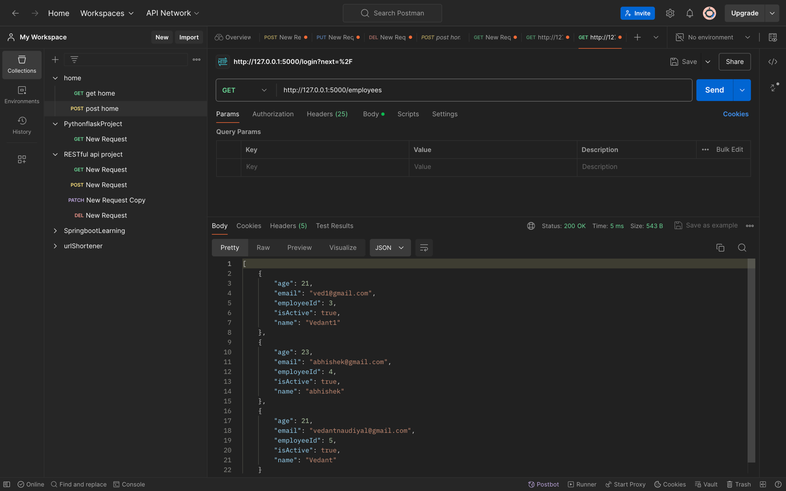
2. GET EMPLOYEE  api -> "/employees/<id>"
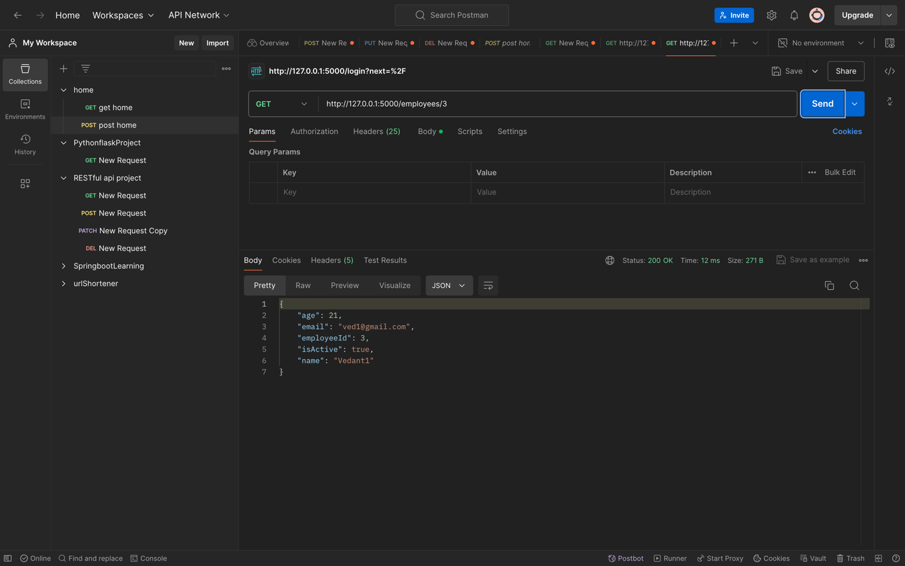
3. DELETE EMPLOYEE  api -> "/employees/<id>"
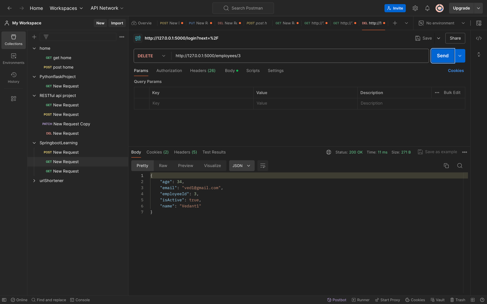
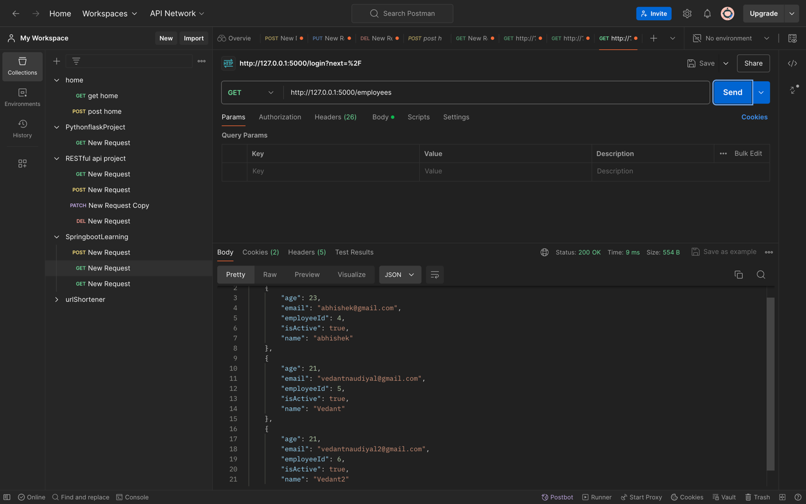
4. POST EMPLOYEE  api -> "/signup" (created on signup)
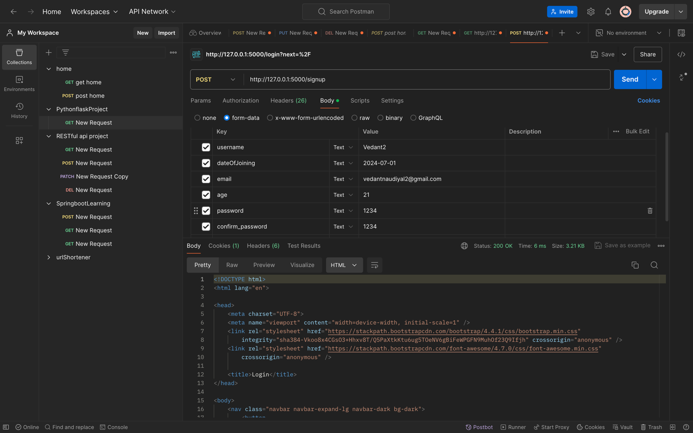
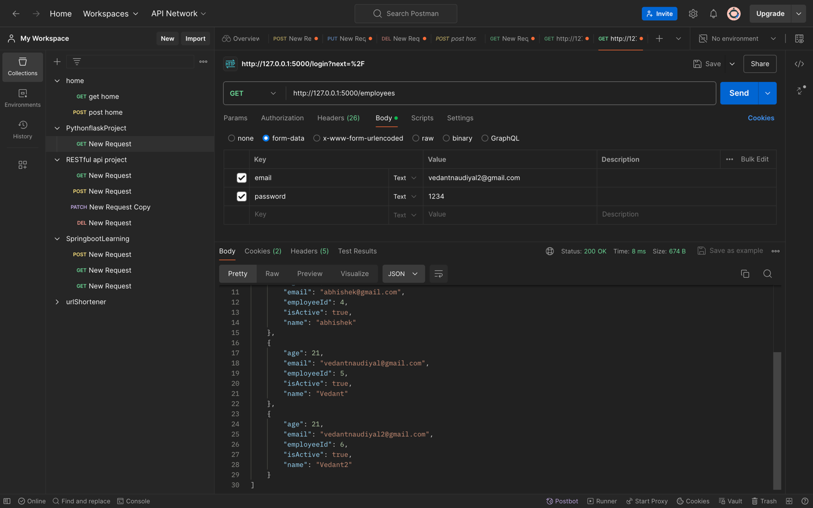
5. PUT EMPLOYEE  api -> "/employees/<id>"
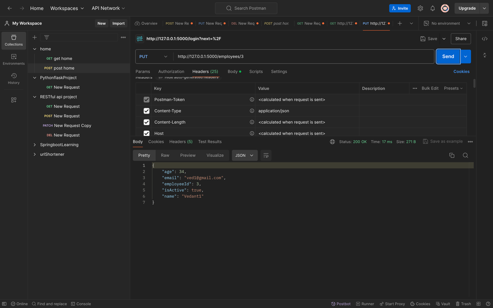****

- UI PAGES & AUTHENTICATION:
1. SIGNIN PAGE
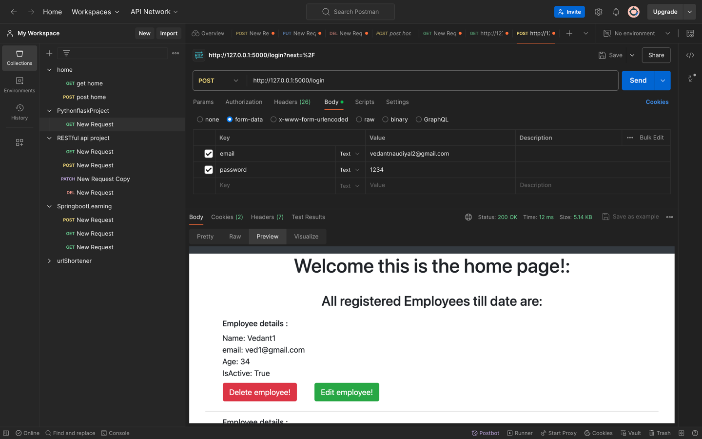
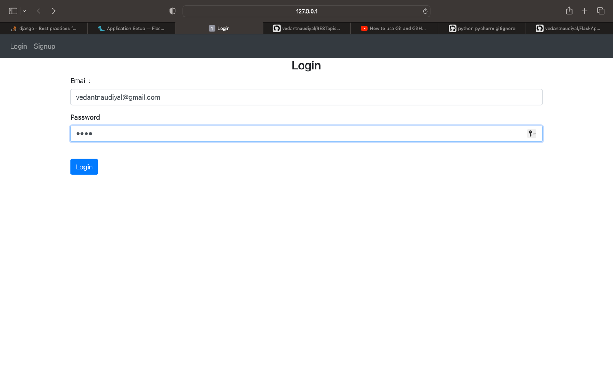

2. SIGNUP PAGE
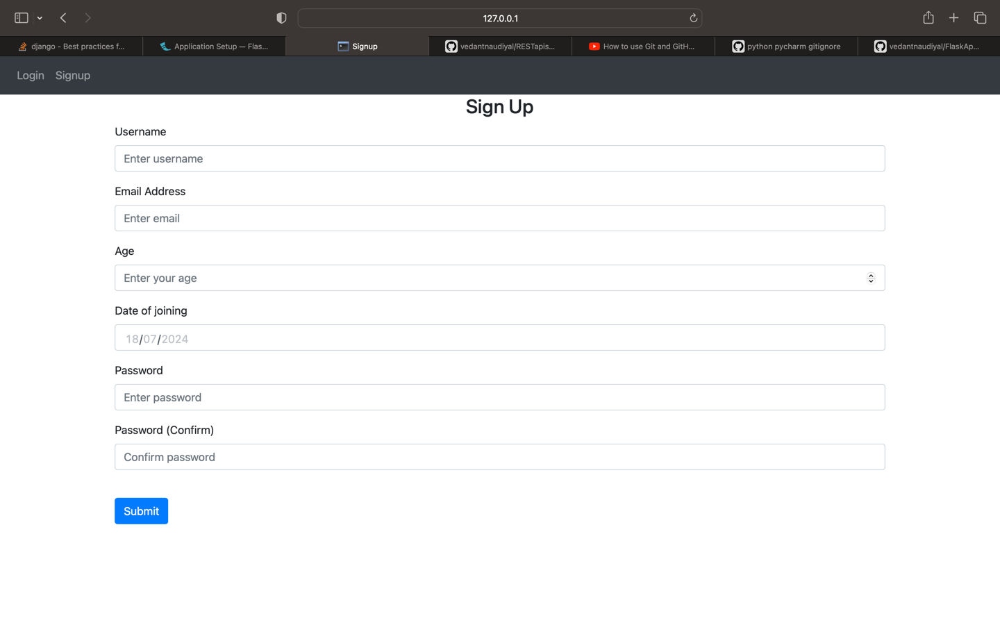
3. HOME PAGE
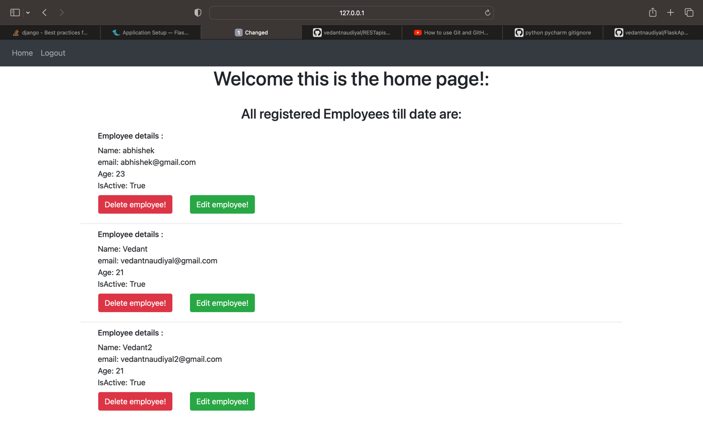

